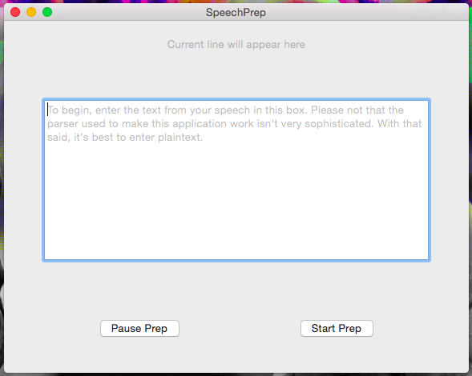
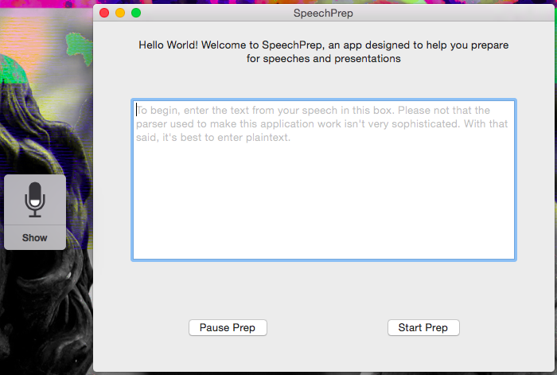

# SpeechPrep
Some say that the best way the practice and remember speeches or presentations is to read and hear the text out-loud. This is the idea behind SpeechPrep.

## How
SpeechPrep was built off of [karaoke](https://github.com/cryptoc1/karaoke), with the added support of the `NSSpeechSynthesizer` class that talks back
to the user.

The `Parser` class is used to format the user inputted text by seperating that text at the end of each sentence. The `Parser` builds an `Array<String>` of sentences.

## Screens



## Notices
To get more verbose information from the program, set `DEVMODE` to `true` in `ViewController.swift`.

```swift

...

import Cocoa
import AppKit

// Setting to true enables logging in a some functions and what-not
var DEVMODE : Bool = false

class ViewController: NSViewController, NSSpeechRecognizerDelegate, NSSpeechSynthesizerDelegate {

...


```

Icon by [Icons8](http://icons8.com)